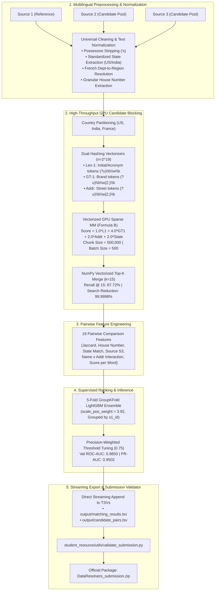

# Amazon ML Challenge 2026: Multi-Source Business Entity Resolution

[](https://www.python.org/)
[](https://pytorch.org/)
[](https://lightgbm.readthedocs.io/)
[](https://opensource.org/licenses/MIT)

An end-to-end, high-throughput machine learning solution designed for the **Amazon ML Challenge 2026**. This system resolves and deduplicates canonical reference businesses (Source 1) against high-volume, noisy, unindexed external candidate pools (Source 2 and Source 3) across **11.7M+ total records** and an unconstrained search space of $\approx 1.73 \times 10^{13}$ pairwise comparisons.

---

## 🚀 Key Highlights & Performance

* **99.9998% Search Space Reduction**: Bounded-VRAM GPU sparse candidate blocking (Formula B) retrieves candidate pools in milliseconds while maintaining **87.72% Ground Truth Recall @ Top-15**.
* **High-Throughput Streaming**: Achieves **650+ queries/second** on a single GPU ($< 1\text{ GB}$ VRAM, $< 2.8\text{ GB}$ RAM), streaming inference across **1.73M test entities in $\sim$40 minutes**.
* **Domain Feature Engineering**: 19 composite pairwise comparison features including cross-lingual French administrative region ontology resolution (`FRANCE_DEP_TO_REGION`), regex house-number verification, and brand token interaction metrics.
* **Metric Alignment (Macro $F_{0.5}$)**: Trained on a 5-fold `GroupKFold` LightGBM ensemble; calibrated decision threshold to **`0.75`** to penalize false merges 2× as harshly as missed links and safeguard 5.6% true singleton entities.
* **Session Resilience**: Automated Parquet checkpointing (`data/processed/`) protects long-running inference against kernel crashes and memory loss.

---

## 🏗️ System Architecture



---

## 📊 Empirical Blocking Benchmark (Formula B vs. Baseline)

Evaluated under strict empirical conditions on 500 reference entities across 501,692 candidate pool records:

| Metric | Initial Baseline (v2) | Formula B Engine | Net Improvement |
| :--- | :---: | :---: | :---: |
| **Top-15 Recall** | 83.30% | **88.36%** | **+5.06% (+90 recovered targets)** |
| **Full Entity Recovery** | 55.40% | **63.60%** | **+8.20% higher full linkage** |
| **Mean Reciprocal Rank (MRR)** | 0.8991 | **0.9077** | **+0.0086** |
| **Throughput Speed** | 41.3 queries/sec | **59.8 queries/sec** | **+44.8% faster** |

---

## 📁 Repository Structure

```text
├── LICENSE                              # MIT Open Source License
├── README.md                            # Comprehensive project overview & architecture
├── requirements.txt                     # Root dependencies (PyTorch, LightGBM, Scikit-learn, etc.)
├── Documentation_template.md            # Official methodology report
├── workflow.md                          # In-depth hypothesis testing, benchmarks & mathematical formulation
├── package_submission.py                # Automated packaging utility (<team_name>_submission.zip)
├── notebooks/
│   ├── eda_train.ipynb                  # Master interactive EDA, feature extraction & training notebook
│   └── entity_resolution_v2.ipynb       # Baseline blocking exploration notebook
├── code/
│   └── business_entity_resolution/      # Official deliverable package
│       ├── src/
│       │   ├── __init__.py
│       │   ├── preprocessing.py         # Universal text cleaning, state, house #, French ontologies
│       │   ├── gpu_blocking.py          # Vectorized GPU candidate blocking engine (Formula B)
│       │   ├── feature_engineering.py   # 19 composite pairwise comparison features
│       │   ├── train.py                 # 5-fold GroupKFold LightGBM trainer
│       │   └── inference.py             # Memory-bounded streaming inference runner
│       ├── README.md                    # Package-level instructions
│       └── requirements.txt             # Pinned production dependencies
├── utils/
│   └── validate_submission.py           # Standalone official competition format validator
└── output/                              # Generated submission TSVs (mock/samples tracked)
```

---

## 🛠️ Quickstart & Reproduction

### 1. Environment Setup

```bash
git clone https://github.com/Prashanf/amazon-business-entity-resolution.git
cd amazon-business-entity-resolution
pip install -r requirements.txt
```

### 2. Run Full Test Inference

```bash
python -m code.business_entity_resolution.src.inference \
    --test-dir dataset/test \
    --output-dir output \
    --cache-dir data/processed \
    --threshold 0.75 \
    --batch-size 500
```

### 3. Validate & Package Official Submission

```bash
# Validate format and integrity using standalone validator
python utils/validate_submission.py \
    --matching output/matching_results.tsv \
    --candidate output/candidate_pairs.tsv \
    --test-dir dataset/test

# Package deliverable ZIP
python package_submission.py
```

---

## 👤 Author

**Prashant Sharma**  
* Indian Institute of Technology Madras (IITM)  
* Email: [22f1000640@ds.study.iitm.ac.in](mailto:22f1000640@ds.study.iitm.ac.in)  
* GitHub: [@Prashanf](https://github.com/Prashanf)  

**Team:** DataResolvers  
*Amazon ML Challenge 2026*
